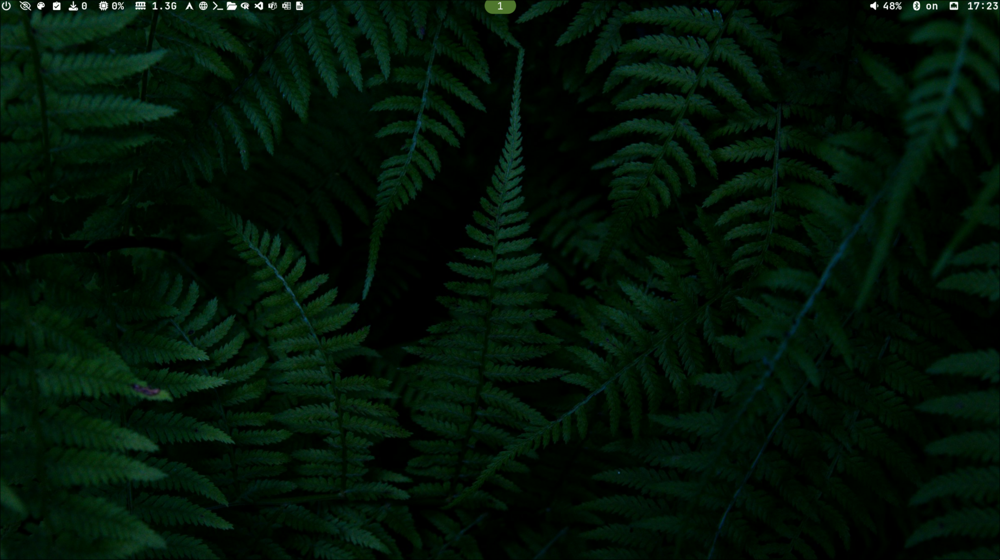
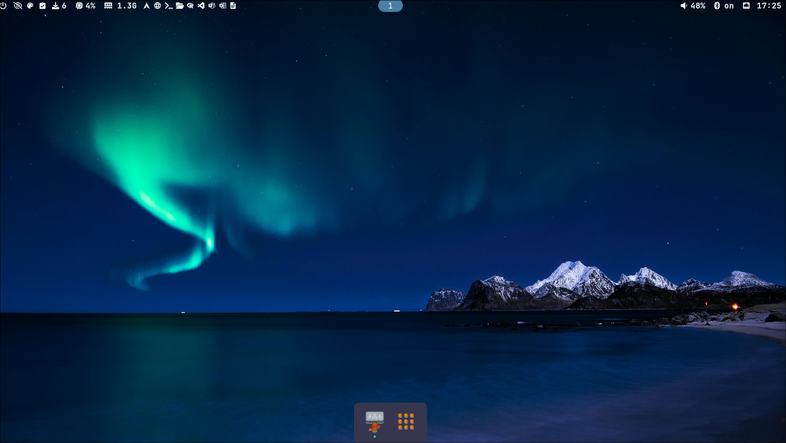
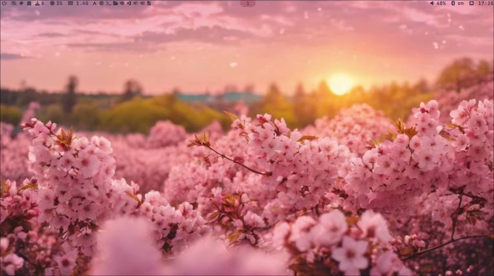
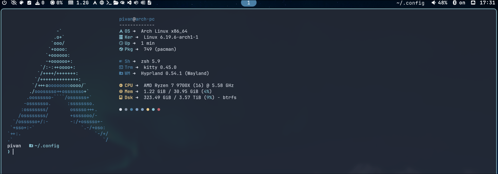

<div align="center">

# 🌲 dotfiles

**Hyprland · Waybar · Rofi · Foot · Kitty · Dunst · Starship**

*A modular, theme-switchable Wayland rice for Arch Linux*

[](https://archlinux.org)
[](https://hyprland.org)
[](LICENSE)

</div>

---

## Screenshots

| Evergreen Forest | Artic Night |
|:---:|:---:|
|  |  |

| Rosé Pine | Rosé Pine Dawn |
|:---:|:---:|
|  |  |

| Catppuccin Mocha | Catppuccin Latte |
|:---:|:---:|
|  |  |

| Fastfetch |
|:---:|
|  |

---

## Features

- **6 themes** — dark, light, and everything in between
- **Single source of truth** — edit one `.conf` file to change every color everywhere
- **Instant switching** — one keybind or waybar click switches theme, reloads Hyprland, dunst, and waybar automatically
- **Wallpaper auto-detection** — drop `<theme-slug>.jpg` in `Themes/wallpapers/` and it gets picked up via hyprpaper
- **Hyprlock themed** — lock screen colors match the active theme
- **nwg-dock support** — dock restarts automatically with the correct theme

---

## Theme Gallery

| Slug | Name | Style |
|---|---|---|
| `evergreen` | Evergreen Forest | Dark · Green |
| `artic-night` | Artic Night | Dark · Blue |
| `rose-pine` | Rosé Pine | Dark · Rose/Mauve |
| `rose-pine-dawn` | Rosé Pine Dawn | Light · Rose/Cream |
| `catppuccin-mocha` | Catppuccin Mocha | Dark · Lavender |
| `catppuccin-latte` | Catppuccin Latte | Light · Lavender |

---

## Stack

| Component | App |
|---|---|
| Compositor | [Hyprland](https://hyprland.org) |
| Bar | [Waybar](https://github.com/Alexays/Waybar) |
| Launcher / Menus | [Rofi](https://github.com/davatorium/rofi) |
| Terminal | [Foot](https://codeberg.org/dnkl/foot) / [Kitty](https://sw.kovidgoyal.net/kitty/) |
| Notifications | [Dunst](https://dunst-project.org) |
| Shell prompt | [Starship](https://starship.rs) |
| Lock screen | [Hyprlock](https://github.com/hyprwm/hyprlock) |
| Fetch | [Fastfetch](https://github.com/fastfetch-cli/fastfetch) |
| Wallpaper | [Hyprpaper](https://github.com/hyprwm/hyprpaper) |
| Dock | [nwg-dock-hyprland](https://github.com/nwg-piotr/nwg-dock-hyprland) |
| Logout menu | [wlogout](https://github.com/ArtsyMacaw/wlogout) |

---

## Structure

```
dotfiles/
└── Themes/
    ├── evergreen.conf          # master color sources
    ├── artic-night.conf
    ├── rose-pine.conf
    ├── rose-pine-dawn.conf
    ├── catppuccin-mocha.conf
    ├── catppuccin-latte.conf
    ├── generate.sh             # theme generator
    ├── switch-theme.sh         # theme switcher (rofi picker)
    ├── scripts/                # per-app generator modules
    │   ├── waybar.sh
    │   ├── hypr.sh
    │   ├── hyprlock.sh
    │   ├── rofi.sh
    │   ├── dunst.sh
    │   ├── starship.sh
    │   ├── foot.sh
    │   ├── kitty.sh
    │   ├── wlogout.sh
    │   ├── nwg-dock.sh
    │   └── fastfetch.sh
    ├── generated/              # auto-generated, do not edit manually
    │   ├── active -> generated/<current-theme>
    │   └── <theme-slug>/
    │       ├── hypr/colors.conf
    │       ├── hyprlock/hyprlock.conf
    │       ├── waybar/colors.css
    │       ├── rofi/<slug>.rasi
    │       ├── dunst/dunstrc
    │       ├── foot/foot.ini
    │       ├── kitty/kitty.conf
    │       ├── starship/starship.toml
    │       ├── wlogout/style.css
    │       └── fastfetch/config.jsonc
    ├── wallpapers/             # one image per theme slug
    │   └── active -> wallpapers/<current-theme>.jpg
    └── screenshots/            # one screenshot per theme
```

---

## Installation

### Dependencies

```bash
sudo pacman -S hyprland hyprpaper hyprlock waybar rofi \
               foot kitty dunst starship fastfetch \
               nwg-dock-hyprland wlogout \
               grim slurp swappy wl-clipboard \
               jq playerctl pavucontrol \
               ttf-jetbrains-mono-nerd ttf-iosevka-nerd
```

### Clone and deploy

```bash
# 1. Clone into home
git clone https://github.com/piariasneira-droid/dotfiles.git ~/dotfiles

# 2. Copy Themes
cp -r ~/dotfiles/Themes ~/Themes

# 3. Make scripts executable
chmod +x ~/Themes/generate.sh ~/Themes/switch-theme.sh

# 4. Generate your first theme
bash ~/Themes/generate.sh

# 5. Reload Hyprland (or log in fresh)
hyprctl reload
```

### Switching themes

```bash
# Via terminal
bash ~/Themes/switch-theme.sh evergreen
bash ~/Themes/switch-theme.sh artic-night
bash ~/Themes/switch-theme.sh rose-pine
bash ~/Themes/switch-theme.sh catppuccin-mocha

# Via rofi picker
bash ~/Themes/switch-theme.sh    # no argument = opens rofi menu
```

---

## How It Works

`generate.sh` sources a `.conf` file, runs every module script in `scripts/`, and writes the generated files into `generated/<theme-slug>/`. It then points `generated/active` to the new theme folder and updates the `wallpapers/active` symlink.

`switch-theme.sh` calls `generate.sh`, then reloads Hyprland, restarts waybar, dunst, and nwg-dock automatically.

---

## Adding a New Theme

1. Copy an existing `.conf` as a template:
   ```bash
   cp ~/Themes/evergreen.conf ~/Themes/mytheme.conf
   ```
2. Edit the colors inside `mytheme.conf`
3. Drop a wallpaper at `~/Themes/wallpapers/mytheme.jpg`
4. Generate and switch:
   ```bash
   bash ~/Themes/switch-theme.sh mytheme
   ```

No scripts to modify, no hardcoded names anywhere.

---

## Lid Close Without Suspend

To keep audio and processes running with the lid closed:

```bash
# /etc/systemd/logind.conf
HandleLidSwitch=ignore
HandleLidSwitchExternalPower=ignore
HandleLidSwitchDocked=ignore
```

```bash
sudo systemctl restart systemd-logind
```

Add to your Hyprland config for automatic screen off on lid close:

```
bindl = , switch:Lid Switch, exec, hyprctl dispatch dpms off
```
